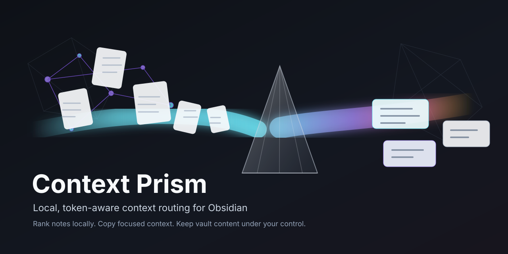

<div align="center">
  <h1>Context Prism</h1>
  <p><strong>Multilingual, token-aware context routing for Obsidian and AI assistants.</strong></p>
  <p>Prepare compact local context packs so AI tools can inspect fewer notes before they answer.</p>
</div>



Context Prism turns an Obsidian vault into a local retrieval layer. It ranks notes related to the active file, explains why they were selected, estimates avoided context, and copies a compact Markdown pack that can be pasted into ChatGPT, Claude, Codex, Antigravity, Cursor, or any assistant that benefits from focused context.

Nothing is sent to external services. The index is built locally from Markdown files through the Obsidian plugin API.

## Demo


## Highlights

- Token-aware context packs for AI-assisted workflows
- Passive suggestions for the active note
- Multilingual indexing profiles: `multilingual`, `en`, `es`, `fr`, `de`, `it`, `pt`
- Mixed-language vault support through comma-separated language profiles
- Title, alias, metadata, and TF-IDF vocabulary ranking
- Explainable candidate reasons and snippets
- Optional review modal for inserting durable wiki-links
- Folder include and exclude filters
- No telemetry, network calls, or external AI dependency

## Why It Exists

AI assistants often waste context by reading too many notes before discovering which files matter. Context Prism moves that discovery step into the vault:

1. The active note becomes the query.
2. Related notes are ranked locally.
3. The user copies a compact context pack.
4. The assistant receives focused evidence instead of broad vault dumps.

The result is a more controlled workflow for large vaults, multilingual notes, and AI-assisted knowledge work.

## Usage

1. Open a Markdown note.
2. Check the status bar for prepared context candidates.
3. Run `Copy AI context pack for current note`.
4. Paste the pack into your AI assistant before asking for analysis, writing help, or implementation planning.
5. Optionally run `Review link suggestions for current note` to insert selected links under the configured footer heading.

## Language Support

Context Prism defaults to `multilingual`, which removes common stopwords across supported language profiles. For more precise ranking, configure `Index languages` in settings:

```text
en
es
en, es
fr, de, it
multilingual
```

The current language layer is lexical and Unicode-aware. It is designed for local retrieval, not translation or semantic embedding.

## Development

Use Node.js 20.19 or newer. Node.js 22 LTS is recommended.

```bash
npm install
npm run dev
```

Production validation:

```bash
npm run typecheck
npm test
npm run build
npm audit
```

## Manual Installation

Copy these files into `<vault>/.obsidian/plugins/context-prism/`:

- `main.js`
- `manifest.json`
- `styles.css`

Reload Obsidian and enable Context Prism under Community plugins.

## Project Docs

- [Architecture](docs/architecture.md)
- [AI context routing](docs/ai-context-routing.md)
- [AI assistant compatibility](docs/ai-assistant-compatibility.md)
- [Testing](docs/testing.md)

## Release Checklist

1. Update `manifest.json`, `package.json`, and `versions.json`.
2. Run `npm run typecheck`, `npm test`, `npm run build`, and `npm audit`.
3. Create a GitHub release with a tag that exactly matches `manifest.json`.
4. Attach `main.js`, `manifest.json`, and `styles.css`.

Pushing a matching version tag can run the release workflow and attach those assets automatically.

## Privacy

Context Prism reads Markdown files through the local Obsidian API and stores settings in the plugin data file. It does not make network requests, collect analytics, or send note content outside the vault.

## License

MIT
