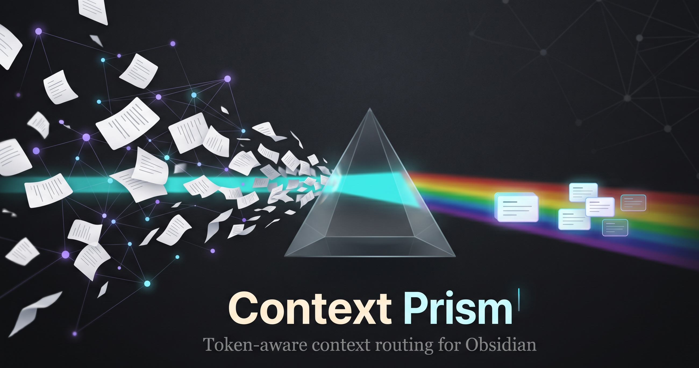
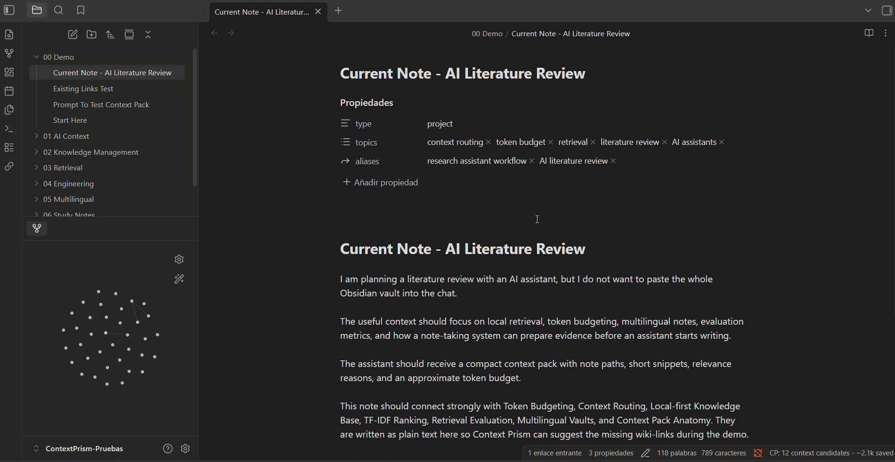

<div align="center">
  <h1>Context Prism</h1>
  <p><strong>Multilingual, token-aware context routing for Obsidian and AI assistants.</strong></p>
  <p>Prepare compact local context packs so AI tools can inspect fewer notes before they answer.</p>
</div>



Context Prism turns an Obsidian vault into a local retrieval layer. It ranks notes related to the active file, explains why they were selected, estimates avoided context, and copies a compact Markdown pack that can be pasted into ChatGPT, Claude, Codex, Antigravity, Cursor, or any assistant that benefits from focused context.

Nothing is sent to external services. The index is built locally from Markdown files through the Obsidian plugin API.

> Trying Context Prism? I am collecting
> [3-minute retrieval feedback](https://github.com/stefanimp/context-prism/issues/1)
> on whether it surfaces the notes you would actually give to an AI assistant.

## Demo



For a text-only walkthrough with fictional notes, see the
[synthetic demo](docs/synthetic-demo.md).

## Highlights

- Token-aware context packs for AI-assisted workflows
- Reviewable AI context packs with include/exclude decisions before copying
- Passive suggestions for the active note
- Multilingual indexing profiles: `multilingual`, `en`, `es`, `fr`, `de`, `it`, `pt`
- Mixed-language vault support through comma-separated language profiles
- Title, alias, metadata, TF-IDF, and BM25 lexical ranking
- Explainable candidate reasons and snippets
- One-time release notes inside Obsidian for major plugin updates
- Optional review modal for inserting durable wiki-links
- Folder include and exclude filters
- Fast lexical retrieval designed to stay responsive in large vaults
- No telemetry, network calls, or external AI dependency

## Why It Exists

AI assistants often waste context by reading too many notes before discovering which files matter. Context Prism moves that discovery step into the vault:

1. The active note becomes the query.
2. Related notes are ranked locally.
3. The user copies a compact context pack.
4. The assistant receives focused evidence instead of broad vault dumps.

The result is a more controlled workflow for large vaults, multilingual notes, and AI-assisted knowledge work.

## Design Priorities

- Local-first: note content stays inside the vault.
- Fast by default: ranking uses lightweight lexical signals instead of remote models or embedding generation.
- Explainable: every candidate includes visible ranking reasons.
- Practical for AI: context packs favor useful snippets over broad note dumps.

## Ranking Controls

Context Prism combines TF-IDF cosine similarity with BM25-style term scoring. Titles, headings, aliases, metadata, and note bodies are weighted separately so strong structural signals can rank without turning every repeated template phrase into a match. Metadata can also boost candidates through shared `area`, `topics`, and `tags`.

If metadata creates noisy matches in a vault, disable `Use metadata ranking` or lower `Metadata weight` in settings.

## Usage

After installing and enabling Context Prism:

1. Open a Markdown note. The active note becomes the retrieval query.
2. Check the status bar for prepared context candidates.
3. For the fast path, run `Copy AI context pack for current note` from the command palette.
4. For an intentional review path, run `Review AI context pack for current note`, inspect the ranked notes, include or exclude candidates, then copy the selected pack.
5. Paste the generated Markdown pack into ChatGPT, Claude, Codex, Cursor, or another assistant before asking for analysis, writing help, or implementation planning.
6. Ask the assistant to use the provided local candidates first before requesting broader vault context.

The review modal is temporary and local to the current note snapshot. It shows paths, snippets, ranking reasons, estimated full-note tokens, estimated context-pack contribution, selected pack tokens, and estimated avoided context. It can also copy a privacy-preserving feedback report for ranking issues without including note bodies or snippets by default.

After updating to a version with major workflow changes, Context Prism shows a one-time "What's new" modal inside Obsidian. You can reopen it later with `Show what's new in Context Prism`.

For manual linking, run `Review link suggestions for current note`, select the useful candidates, and insert them under the configured footer heading.

Use settings to adjust the suggestion limit, indexed languages, included or excluded folders, metadata ranking, and metadata weight.

## Feedback and Feature Requests

Context Prism is built around practical retrieval quality: the important question is whether it surfaces the notes you would actually give to an AI assistant.

Feedback is especially useful when it covers:

- notes that should have appeared but did not
- candidates that looked related but were not useful
- snippets that were too short, too long, or poorly centered
- multilingual vault behavior
- token estimates and whether they help the workflow
- feature ideas for making context packs easier to use

If you try the plugin, please leave
[3-minute retrieval feedback](https://github.com/stefanimp/context-prism/issues/1).
The most useful answer is whether Context Prism surfaced the notes you would have copied manually into an AI assistant.

For bugs, feature requests, or longer ranking reports, open an issue through
[GitHub Issues](https://github.com/stefanimp/context-prism/issues/new/choose).
For ranking feedback, prefer small synthetic examples or redacted note excerpts that show the retrieval problem clearly.

## Language Support

Context Prism defaults to `multilingual`, which removes common stopwords across supported language profiles. For more precise ranking, configure `Index languages` in settings:

```text
en
es
en, es
fr, de, it
multilingual
```

The current language layer is lexical and Unicode-aware. It is designed for local retrieval, not translation or semantic embedding.

## Development

Use Node.js 20.19 or newer. Node.js 22 LTS is recommended.

```bash
npm install
npm run dev
```

Production validation:

```bash
npm run typecheck
npm test
npm run build
npm audit
```

## Manual Installation

Copy these files into `<vault>/.obsidian/plugins/context-prism/`:

- `main.js`
- `manifest.json`
- `styles.css`

Reload Obsidian and enable Context Prism under Community plugins.

## Project Docs

- [Architecture](docs/architecture.md)
- [AI context routing](docs/ai-context-routing.md)
- [AI assistant compatibility](docs/ai-assistant-compatibility.md)
- [Synthetic demo](docs/synthetic-demo.md)
- [Testing](docs/testing.md)

## Release Checklist

1. Update `manifest.json`, `package.json`, and `versions.json`.
2. Run `npm run typecheck`, `npm test`, `npm run build`, and `npm audit`.
3. Create a GitHub release with a tag that exactly matches `manifest.json`.
4. Attach `main.js`, `manifest.json`, and `styles.css`.

Pushing a matching version tag can run the release workflow and attach those assets automatically.

## Privacy

Context Prism reads Markdown files through the local Obsidian API and stores settings in the plugin data file. It does not make network requests, collect analytics, or send note content outside the vault.

## License

MIT
